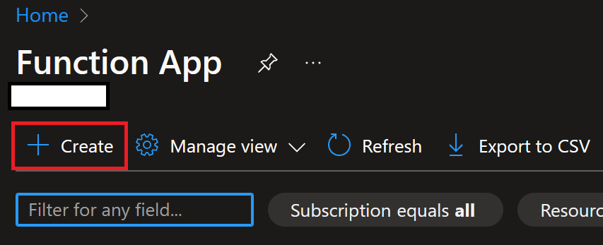

TODO: Add int test instr. always do dcoker compose -f docker-compose.tests.yml down first

# DiagnoseAI Core API

This is the DiagnoseAI core API; the main deliverable of COMP0016 Team
4.

## Overview - High Level

Core API provides a common API that can be utilized by all interfaces
intending to integrate their services with DiagnoseAI. At a high
level, it exposes the following functionality:

1. Processes, vectorizes and indexes documents from the Uploader
   interface into a Vector Database (`file_upload_trigger`).
2. Guarding underlying services with secure pre-authenticated
   URLs. Services affected includes `WebPubSubService` and `Azure Blob Storage`.
3. Handling multiple conversations (including history) between any
   connected users to Azure OpenAI.
4. Indexing and summarizing conversations. Summarized conversations
   are **private** to the user, and can be referenced in a future
   conversation.
5. Management of indexes around the Vector Database; promoting any
   documents used for validation (on the Uploader) to a real index
   used for production (on any participating interfaces).

For the full API specification, please see:

- `core/swagger.yml` - Contains the documentation for all available
  endpoints. At the time of writing, this includes:
  - `/chat_conversation`: Establishes a chat connection with any
    participating interface. This endpoint returns a preauthenticated
    `WebSocket` URL that interfaces should establish a connection to.
  - `/chat_history`: Retrieves all past messages of a chat given a
    conversation.
  - `/chat_done`: Marks a conversation as done, automatically
    summarizing the contents for future reference.
  - `/work_order`: Retrieves all associated _work orders_ to a
    user. _Work orders_ describes all the information a technician
    requires to complete a job; task name, task description, and the
    machine to repair. In DiagnoseAI, work orders and conversations
    share a one-to-one relationship.
- `core/asyncapi2.yml` - Contains `WebSocket` message templates
  supported by Core API. The `WebSocket` URL is generated with
  `/chat_conversation`.

## Overview - Technicality

Core API acts as an aggregated proxy between the WebApp and relevant
services:

- Authentication with a third-party OAuth provider
- SQL Databases
- Azure AI Search (formerly Cognitive Search)
- Azure API Management Service
- Azure Blob Storage
- Azure OpenAI Service
- Azure WebPubSubService

As mentioned in the overview above, the developer is encouraged to
read `core/swagger.yml` and `core/asyncapi2.yaml` for API documentation.

Core API is built with the following design goals in mind:

1. Scalable
2. Auth-independent
3. Cloud-native

By being _serverless_ on **Azure Function App**, and using JWT tokens,
Core API achieves the above goals to a tee.

# Prerequisites

As a consequence of running on **Azure Function App**, it is designed
_not_ to run on a local computer. Pure HTTP endpoints, such as those
found in:

- `functions/chat_connection.py`
- `functions/chat_done.py`
- `functions/chat_history.py`
- `functions/work_order.py`

can be ran locally with a local database and **Azurite** (explained
later), but will still require connection to some real Azure services
with no known local replacements, such as:

- Azure OpenAI
- Azure WebPubSubService
- AI Search

Hence, it is imperative that the developer **must** have access to all
requisite services for a successful deployment. Should this not be
possible, it is recommended that DiagnoseAI be evaluated via the
online demo.

The guide following this assumes an environment is setup to have:

1. An Azure Account with access to services stated in [Overview -
  Technicality](#overview---technicality)
2. Python 3.10
3. A Linux machine. Most commands can be substituted for a non-Linux
   setup, however, that is outside the scope of this guide.

# Guide

There are **two** guides embedded in this README:

1. **Deployment Guide** - This is the guide to read if you intend to
   deploy the repository as-is, without any unnecessary modifications.
2. **Development Guide** - This is the guide to read if you intend to
   either make changes to the repository, or run HTTP endpoints
   locally. (**Note**: It is **not possible** to run the `chat`
   function locally)

The above guides have some overlapping sections; hence, please refer
to the below table of contents.

**Table of Contents (Deployment Guide)**

1. [Installing Azure Functions Core
   Tools](#installing-azure-functions-core-tools)
2. [Creating the relevant Azure
   services](#creating-the-relevant-azure-services)
3. [Deploying Core API](#deploying-core-api)
4. [Initializing the DB via CoreAPI](#initializing-the-db-via-coreapi)

**Table of Contents (Development Guide)**

1. [Installing Azure Functions Core
   Tools](#installing-azure-functions-core-tools)
2. [Configuring Local Development](#configuring-local-development)
4. [Installing development
   dependencies](#installing-development-dependencies)
5. [Running Azurite](#running-azurite)
6. [Running MSSQL](#running-mssql)
7. [Installing required
   dependencies](#installing-required-dependencies)
2. [Creating the relevant Azure
   services](#creating-the-relevant-azure-services)
3. [Running the functions locally](#running-the-functions-locally)
3. [Deploying Core API](#deploying-core-api)

----

## Installing Azure Functions Core Tools

Run the following commands:

```
sudo npm install -g azure-functions-core-tools@4 --unsafe-perm true \
sudo npm install -g azurite # optional for deployment-only
```

`azure-function-core-tools` provide the `func` command that is
required to deploy the functions onto Azure Function Apps.

`azurite` simulates some Azure storage services such as Azure's Blob
Storage. This is not required for deployment purposes.

Return to [Guide](#guide).

----

## Creating the relevant Azure services

As a recap, Core API requires the following services:

- Azure Function Apps
- SQL Databases
- Azure AI Search
- Azure API Management Service
- Azure Blob Storage
- Azure OpenAI Service
- Azure WebPubSubService
- Clerk (acting as the external identity provider)

The following sections will walk-through the creation process of each
feature above; this entire section must be done before moving on to
the next step any of the guides.

#### Resource Group

A resource group contains all of the resources you will create for
DiagnoseAI.

1. Navigate to the [Azure Portal](https://portal.azure.com).
2. Search "Resource Groups" on the services search bar, and click on
   it.
   
3. Click on the "+ Create" button.
   
4. Fill in a memorable name for the resource group, and choose your
   closest region. For all mentions of a resource group from here on
   out, the guide will refer to this very group.
   

#### Azure Function Apps

1. Navigate to the [Azure Portal](https://portal.azure.com).
2. Search "Function App" on the services search bar, and click on it.
   
3. Click "Create".
   
4. Select the _Resource Group_ (created in an earlier section), and
   name it anything you want. You should remember the name; this will
   be referred to as "Function App Name" from here on out.
   
5. Choose "Python" as the Runtime stack, "3.10" as the version, and
   the closest region to wherever the deployment will be. Set
   Operating System to "Linux". You can choose to use any consumption
   plan for the function app, although the project was developed with
   "Consumption (Serverless)" in mind.
   
6. Click "Review + Create".
   

Your function app should now be created. When the guide refers to "the
function app", the reader can assume _this_ is the referred Function
App.

Return to [Guide](#guide).

----

#### SQL Databases

1. Navigate to the [Azure Portal](https://portal.azure.com).
2. Search "SQL Databases" on the services search bar, and click on it.
   
3. Click "Create".
4. Select the _Resource Group_ (created earlier), and name it anything
   you want. You should remember the name; this will be referred to as
   "Database name" from here on out.
   
5. Choose any "Server" available; if there are none, create one.
   
6. (Optional to save costs) Choose "Development" under "Workload
   Environment".
7. Click "Review + Create"
   
8. Stay on the resource creation page until the database has been
   fully created.
   
9. Search "SQL Server" on the services search bar, and click on it.
   
10. Click on the SQL Server you used in step 5.
    
11. Click on "Reset Password".
    
12. Reset the password to anything that meets the requirements, and
    remember it / memo it down.
    
13. Take note of the "Server name" and "Server admin".
    

You should end this session with the following information:

- Database Name (the one you specified in step 4)
- Database Username (step 13)
- Database Password (step 12)
- Database URL (step 13)

They will be referenced as such henceforth.

Return to [Guide](#guide).

----

#### Azure AI Search

1. Navigate to the [Azure Portal](https://portal.azure.com).
2. Search "AI Search" on the services search bar, and click on it.
   
3. Click "Create".
   
4. Select the _Resource Group_ (created earlier), and name it anything
   you want.
   
5. Set the location to the closest region to the deployment.
   
6. Click on "Review + create". Wait for the creation to be done; you
   will need the resource to get the Search Service URL and API Keys.
   
7. Once the creation is done, click on "Go to resource". On the
   "Overview" page, copy the "URL". This is the Search Service URL,
   and will be referred as such moving forward.
   
8. Click on "Keys". If not already selected, select "API keys"; then,
   copy the primary admin key. This is referred to as the Search
   Service API Key.
   

> Side Note: Ideally, on production, there should be _two_ of such
> services; however, to simplify the deployment, only one will be
> deployed.

By the end of this sub-section, you should have:

- Cognitive Search Endpoint (step 7)
- Cognitive Search API Key (step 8)

Return to [Guide](#guide).

----

#### Azure API Management Service

API Management Service is the front-facing service that has, of many
things, DDoS protection, and subscription management. Subscriptions
create client-facing API keys that can be used for downstream
services.

1. Navigate to the [Azure Portal](https://portal.azure.com).
2. Search "API Management Services" on the services search bar, and
   click on it.
   
3. Click "Create".
4. Select the _Resource Group_ (created earlier), and name it anything
   you want.
   
5. Choose a region closest to the target location of deployment, and
   anything applicable for "Organisation name" and "Administrator
   email". Please note that "Administrator email" has to be a valid &
   working email address; API Management Service will send an email to
   the email stated.
   
6. (Optional) Set pricing tier to "Developer".
   
7. Click "Review + create".
   
8. You can leave the page to wait for the resource to create. Once the
   creation is complete, you should get an email; either way, find
   your way to the API Management service.
   
9. On the side menu, click on APIs.
   
10. Click on "Add API"; then click on "HTTP".
    
11. Set "Display name" and "Name" to anything you want; ideally,
    something that denotes it is a Core API related resource. A
    suggested example is "diagnose-ai-core"
    
12. Once the API has been created, select it from the side menu, then
    click "Add operation".
    
13. You will now create the following endpoints:
    - Method: `POST`, URL: `/chat_done`, Display Name: `Chat Done`
    - Method: `GET`, URL: `/work_order`, Display Name: `Work Order`
    - Method: `POST`, URL: `/validation_to_production`, Display Name:
      `Validation to Production`
    - Method: `POST`, URL: `/chat_connection`, Display Name: `Chat
      Connection`
    - Method: `GET`, URL: `/chat_history`, Display Name: `Chat
      History`
    
14. In each created endpoint, go to "Inbound Processing" and set the
    XML to the following:
    ```xml
    <policies>
        <inbound>
             <base />
             <set-backend-service id="apim-generated-policy" backend-id="<function app name>" />
         </inbound>
         <backend>
             <base />
         </backend>
         <outbound>
             <base />
         </outbound>
         <on-error>
             <base />
         </on-error>
    </policies>
    ```

    where `<function app name>` is the function name is generated in
    [Azure Function Apps](#azure-function-apps).
    
15. On the main sidebar, click on "Subscriptions".
    
16. Click on "Add subscription", and name it anything you want. Once
    the subscription has been created, copy the "Primary key". This is
    referred to as "Subscription Key" across the entirety of
    DiagnoseAI, including the Uploader and WebApp.
    

By the end of this section, you should end up with a Primary key.

Return to [Guide](#guide).

----

#### Azure Blob Storage

Blob storage is used to store:
- Images uploaded by the user (i.e. the `images` container)
- Documents used for verification (i.e. the `verification` container)
- Documents used for production (i.e. the `production` container)

1. Navigate to the [Azure Portal](https://portal.azure.com).
2. Search "Storage Account" on the services search bar, and
   click on it.
   
3. Click "Create".
4. Select the _Resource Group_ (created earlier), and name it anything
   you want.
   
5. Choose a region closest to the target deployment site. The rest can
   be left at defaults, although you can optionally reduce
   "Redundancy" to LRS to save some costs.
   
6. Click on "Review" and "Create". Wait for the resource to be
   created.
   
7. Upon creation, click on "Go to resource".
   
8. On the side menu, click on "Containers".
   
9. You will now create the following containers:
   - `images`
   - `production`
   - `verification`

   Click on "+ Container", then create name them according to the
   above names.
   
10. Click on "Access keys" on the side menu.
    
11. Copy the "Connection String" field. This will be referred to as
    "Storage Account Connection String".
    

By the end of this section, you should have:
- Storage Account Connection String
- `images`, `produciton` and `verification` containers

Return to [Guide](#guide).

----

#### Azure OpenAI Service

> **Important Note**: At the time of writing, GPT4V is only available
> on these regions: Australia East, Sweden Central, Switzerland North,
> and West US. [Relevant Article
> Link](https://techcommunity.microsoft.com/t5/ai-azure-ai-services-blog/gpt-4-turbo-with-vision-is-now-available-on-azure-openai-service/ba-p/4008456)
> The current deployment guide assumes the creation of two Azure
> OpenAI services.

1. Navigate to the [Azure Portal](https://portal.azure.com).
2. Search "Azure OpenAI" on the services search bar, and
   click on it.
   
3. Click "Create".
4. Select the _Resource Group_ (created earlier), and name it anything
   you want. This will be referred to as "OpenAI Name".
   
5. At the time of writing, there is only one "Pricing tier", which is
   **Standard S0**. Pick the region closest to you.
   
6. Click next until you can click "Create"
   
7. Wait for the resource to be created. Once the resource is created,
   click on "Keys and Endpoints" from the side menu.
   
8. Copy "Key 1". We will refer to this as "Core OpenAI Key". Take note
   of the endpoint. We will refer to this as "Core OpenAI Endpoint".
9. Click on "Overview", then click on "Go to Azure OpenAI Studio".
   
10. Click on "Deployments". You will now be deploying a minimum of 2 models:
    - `gpt-35-turbo`
    - `text-embedding-ada-002`

    1. Click on "Create new deployment"
    2. Under "Select a model", choose one of the models stated
       above. Name it something like "diagnoseai-model".
    3. Click "Create".

    
11. Once you have created both deployments, create another OpenAI
    service. Repeat Step 1 to Step 8, picking one of the following
    regions, depending on how close you are to each of the following
    regions: `Australia East, Sweden Central, Switzerland North, West
    US`. The guide will refer to the API key and Endpoint generated
    here as "Vision OpenAI Key" and "Vision OpenAI Endpoint".
12. You will now be deploying the GPT4-V model. Click on
    "Deployments". Then:

    1. Click on "Create new deployment"
    2. **You must** switch "Model version" to "vision-preview". Set
       the deployment name to something like
       `image-recognition-model`.
    3. Click "Create".

    

By the end of this section, you should have the following:

- Core OpenAI Key
- Core OpenAI Endpoint
- Vision OpenAI Key
- Vision OpenAI Endpoint

Return to [Guide](#guide).

----

#### Azure WebPubSubService

1. Navigate to the [Azure Portal](https://portal.azure.com).
2. Search "Web PubSub Service" on the services search bar, and
   click on it.
   
3. Click "Create".
   
4. Click on "Create" under "Web PubSub".
   
5. Select the _Resource Group_ (created earlier), and name it anything
   you want.
   
6. Choose the closest region to the target deployment.
   
7. (Optional) Downgrade Pricing tier to "Free_F1".
   
8. Click "Review + create". Wait for the resource creation to
   complete, and then click on "Go to resource".
   
9. On the side bar, click on "Keys" and copy the Connection
   string. This will henceforth be referred to as the WebPubSub
   connection string.
   
10. Click on "Settings" in the sidebar, and click "Add".
    
11. Set the Hub name to "chat" (copy the casing). Do not allow
    anonymous clients. Click "Save"
    

By the end of this section, you should have:
- WebPubSub Connection String

Return to [Guide](#guide).

----

#### Clerk

Clerk is used as the demonstration authentication provider due to its
ease-of-use. In production, it is likely to be swapped for Microsoft
Entra, or another type of OAuth SSO.

1. Go to [Clerk](https://clerk.com). Register for an account if you
   don't already have one.
2. Create a new organization. Name it anything, such as
   "diagnoseai". Click on "Create organization".
   
3. (Optional, highly recommended) Turn on the allow list. On the side
   bar, expand (if not already expanded) "User & Authentication" and
   click on "Restrictions". Toggle "Enable allowlist" (such that it is
   turned on), and add your email address to the allow list.
   
4. On the sidebar, click on "Users", then click on "Create User". Fill
   in the information with credentials you will use to login to
   DiagnoseAI.
   
5. On the sidebar, locate and click on "API Keys".
   
6. Scroll down and click on "Advanced", and copy the "PEM public
   key". The guide will refer to this as "PEM public key".
   
7. (Optional for now) For WebApp and Uploader, you may have to copy
   both "Publishable key" and "Secret keys".
   

By the end of this section, you should have:
- PEM public key
- A valid user account

Return to [Guide](#guide).

----

## Configuring Local Development

Create a JSON file called `core/local.settings.json`.

``` json
{
  "IsEncrypted": false,
  "Values": {
    "FUNCTIONS_WORKER_RUNTIME": "python",
    "AzureWebJobsFeatureFlags": "EnableWorkerIndexing",
    "AzureWebJobsStorage": "UseDevelopmentStorage=true",
    "AzureWebJobsSecretStorageType": "files",
    "BlobBindingConnection": "DefaultEndpointsProtocol=http;AccountName=devstoreaccount1;AccountKey=Eby8vdM02xNOcqFlqUwJPLlmEtlCDXJ1OUzFT50uSRZ6IFsuFq2UVErCz4I6tq/K1SZFPTOtr/KBHBeksoGMGw==;BlobEndpoint=http://127.0.0.1:10000/devstoreaccount1;QueueEndpoint=http://127.0.0.1:10001/devstoreaccount1;TableEndpoint=http://127.0.0.1:10002/devstoreaccount1;",
    "DocumentEndpoint": "",
    "DocumentKey": "",
    "OpenAIEndpoint": "",
    "OpenAIKey": "",
    "CognitiveSearchEndpoint": "",
    "CognitiveSearchKey": ""
    "WebPubSubConnectionString": "",
    "WebPubSubHubName": "chat",
    "DatabaseURL": "",
    "DatabaseName": "",
    "DatabaseUsername": "",
    "DatabasePassword": "",
    "DatabaseSelfSigned": true,
    "ImageBlobConnectionString": "",
    "ImageBlobContainer": "",
  }
}
```

The endpoint and keys should be self-explanatory.

**Important**: To get proper linting, you must install the current
package: `pip install -e .` See [this StackOverflow
answer](https://stackoverflow.com/a/50193944) for why this is required.

## Installing developer dependencies

`core/requirements.txt` are the dependencies required for the Azure
functions, while `requirements-dev.txt` are for the developers. The
latter includes tools such as:

- `pylint`
- `mypy`
- `flake8`

## Running Tests

Before continuing, ensure all dependencies, and `pip install -e .` has
been run on the project root directory.

Then, to run tests, navigate to the the `core` directory. The
following command will run the test:

``` text
python3 -m unittest discover test
```


## Running Azurite

For the most part, you will need to use some kind of storage
emulator. This is where `azurite` comes into play.

First, start the storage emulator:

``` shell
azurite --silent --location /tmp/azurite --debug /tmp/azurite/debug.log
```

Azurite uses the following connection string for all the types of
resources that it emulates:

``` text
DefaultEndpointsProtocol=http;AccountName=devstoreaccount1;AccountKey=Eby8vdM02xNOcqFlqUwJPLlmEtlCDXJ1OUzFT50uSRZ6IFsuFq2UVErCz4I6tq/K1SZFPTOtr/KBHBeksoGMGw==;BlobEndpoint=http://127.0.0.1:10000/devstoreaccount1;QueueEndpoint=http://127.0.0.1:10001/devstoreaccount1;TableEndpoint=http://127.0.0.1:10002/devstoreaccount1;
```

Then, on another terminal, create the respective containers:

``` text
az storage container create -n validation-documents --connection-string "<connection string here>"
```

To upload files / interact with the `azurite` blob, use the `az
storage blob` commands.

``` text
az storage blob upload -f something.txt -c validation-documents -n something.txt --connection-string "<connection string here>"
```

## Running MSSQL

Since we're using SQL on Azure, it's likely that we'll be using
MSSQL. When running tests related to the database,
e.g. `chat_connection` or `chat_history`, you will have to run a local
installation of an SQL server, ideally MSSQL.

``` text
docker run -e "ACCEPT_EULA=Y" -e "MSSQL_SA_PASSWORD=Strong@Passw0rd123!" -p 1433:1433 -d mcr.microsoft.com/mssql/server
```

Remember to update the `DatabaseURL`, `DatabaseName`,
`DatabaseUsername`, `DatabasePassword`, and `DatabaseSelfSigned`
fields in `local.settings.json`:

- `DatabaseURL`: probably `127.0.0.1`
- `DatabaseName`: probably `db`
- `DatabaseUsername`: `SA`
- `DatabasePassword`: `Strong%40Passw0rd123!`
- `DatabaseSelfSigned`: true

> **Important**: Ensure to unset `DatabaseSelfSigned` in production.

If you're running the function locally (e.g. `func start --functions
chat_history`), you will also need to install `odbc` tools:

``` text
curl https://packages.microsoft.com/keys/microsoft.asc | sudo tee /etc/apt/trusted.gpg.d/microsoft.asc \
curl https://packages.microsoft.com/config/ubuntu/22.04/prod.list | sudo tee /etc/apt/sources.list.d/mssql-release.list \
sudo ACCEPT_EULA=Y apt-get install -y msodbcsql17
```

For other distributions / operating systems, please refer to [this
link](https://learn.microsoft.com/en-us/sql/linux/sql-server-linux-setup-tools?view=sql-server-ver16&tabs=ubuntu-install).

Then, create the _database_ (this is not done automatically in the
code because the SQL instance on Azure should already come with a
database name):

``` text
docker exec -it <container name> bash -c "/opt/mssql-tools/bin/sqlcmd -S localhost -U SA -P Strong@Passw0rd123!"
1> CREATE DATABASE db;
2> GO
```

## Running the functions locally

Most of the functions written here can be run locally after running
[Azurite](#azurite), run the following command within `core/`:

``` text
func start
```

Then, start uploading starting to begin the process.

## Deploying

In the `core/` folder, run:


``` text
func azure functionapp publish <function app name>
```

In our environment, this is currently `diagnose-ai-core`.
